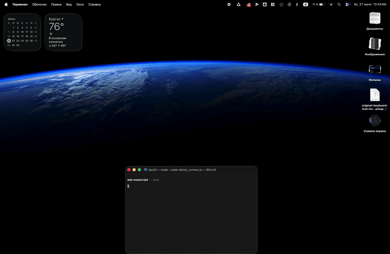

<div align="center">


**Let Claude control your Mac.** Move windows, click menus, type text, read clipboard, manage browser tabs — 12 typed tools with input validation and security guardrails.

[](https://www.npmjs.com/package/mcp-osascript)
[](https://support.apple.com/macos)
[](https://nodejs.org)
[](LICENSE)
[](#testing)

</div>

---



## Quick Start

```json
{
  "mcpServers": {
    "osascript": {
      "command": "npx",
      "args": ["-y", "mcp-osascript"]
    }
  }
}
```

Add this to your Claude Desktop config (`Settings → Developer → Edit Config`), restart Claude, and you're ready.

<details>
<summary>Config for other clients (Cursor, VS Code, Claude Code)</summary>

**Cursor / VS Code (Copilot)**
```json
{
  "mcpServers": {
    "osascript": {
      "command": "npx",
      "args": ["-y", "mcp-osascript"]
    }
  }
}
```

**Claude Code**
```bash
claude mcp add osascript -- npx -y mcp-osascript
```

**From source (development)**
```bash
git clone https://github.com/m0rvayne/mcp-osascript.git
cd mcp-osascript && npm install
# then use: "command": "node", "args": ["/path/to/mcp-osascript/server/index.js"]
```
</details>

## Try These Prompts

Once installed, ask Claude:

| Prompt | What happens |
|--------|-------------|
| *"Open Safari and show me what tabs I have"* | Launches Safari, reads all tab titles and URLs |
| *"Move the Finder window to the left half of my screen"* | Resizes and positions the window |
| *"Click File → Export as PDF in Keynote"* | Navigates the menu bar and clicks the item |
| *"Copy the URL from my active Chrome tab"* | Reads browser tabs, finds the active one |
| *"Type 'Hello World' into the active text field"* | Simulates keyboard input |
| *"Show a notification when you're done"* | Displays a native macOS banner |
| *"What app am I using right now?"* | Returns the frontmost app name and bundle ID |
| *"Press Cmd+Shift+4"* | Triggers the screenshot shortcut |
| *"List all items in the Edit menu of VS Code"* | Introspects the menu bar |
| *"Close the second window of Terminal"* | Targets a specific window by index |

## Tools

12 typed tools, each with input validation, error classification, and permission-aware error messages.

| Tool | What it does | Permission |
|------|-------------|------------|
| `run_osascript` | Execute any AppleScript or JXA script | None |
| `get_clipboard` | Read clipboard as text | None |
| `set_clipboard` | Write text to clipboard | None |
| `send_notification` | Show macOS notification banner | None |
| `open_url` | Open URL in browser (http/https/mailto only) | None |
| `open_app` | Launch or bring app to front | None |
| `get_frontmost_app` | Get active app name + bundle ID | Automation |
| `get_browser_tabs` | List tabs in Safari, Chrome, or Arc | Automation |
| `type_text` | Type text into active app (max 500 chars) | Accessibility |
| `press_key` | Press key with modifiers (cmd+c, return, f5) | Accessibility |
| `manage_windows` | List / move / resize / minimize / fullscreen / close | Accessibility |
| `app_menu` | List or click menu items in any app | Accessibility |

## Self-Correcting Menus

When Claude tries to click a menu item that doesn't exist, the server automatically returns the list of available items at that level — so Claude can retry with the correct name. No other MCP server does this.

```
User:   "Click File → Export as PDF in Preview"
Claude: calls app_menu click ["File", "Export as PDF"]
Server: "Menu item 'Export as PDF' not found in 'File'.
         Available: ['New from Clipboard', 'Open...', 'Close', 'Save',
         'Duplicate', 'Rename...', 'Export...', 'Export as PDF...']"
Claude: calls app_menu click ["File", "Export as PDF..."]
Server: "Clicked: File > Export as PDF..."
```

## Why mcp-osascript?

| | mcp-osascript | steipete (824★) | peakmojo (463★) |
|---|:---:|:---:|:---:|
| Typed tools with validation | **12** | 2 (generic) | 1 (generic) |
| URL scheme allowlist | **http/https/mailto** | No | No |
| Env isolation (child process) | **PATH+HOME+LANG only** | Full process.env | Full process.env |
| Process group kill (no orphans) | **SIGTERM→SIGKILL** | No | No |
| Error sanitization (paths, tokens) | **Yes** | No | No |
| Prototype pollution protection | **Object.create(null)** | No | No |
| Self-correcting menu click | **Yes** | No | No |
| Integration tests | **41** | 0 | 0 |
| Stdin piping (no temp files) | **Yes** | Temp files | Temp files |

## Permissions

Tools work in three tiers:

- **No permission needed** — clipboard, notifications, URLs, apps. Works immediately.
- **Automation** — browser tabs, frontmost app. macOS prompts once per browser.
- **Accessibility** — keyboard, windows, menus. Grant once in **System Settings → Privacy & Security → Accessibility**.

When a permission is missing, the server tells you exactly what to do:

```
"Accessibility permission required. Grant access to 'osascript'
in System Settings > Privacy & Security > Accessibility."
```

## Testing

```bash
npm test
```

41 integration tests covering all 12 tools — input validation, security boundaries (URL scheme blocking, prototype pollution, script size limits), timeout enforcement, and permission error handling.

<details>
<summary>Security & Architecture</summary>

### Security

- `run_osascript` executes arbitrary code — this is by design. The MCP client (Claude) is the trust boundary.
- Scripts piped via stdin to `/usr/bin/osascript` — no temp files, no TOCTOU race conditions.
- Script size: 50 KB max. Output: 50K chars max (truncated).
- Error messages sanitized — filesystem paths, tokens, and passwords are stripped.
- Child processes get minimal env: `PATH`, `HOME`, `LANG` only — no API keys or secrets leak.
- URL scheme allowlist — `file://`, `smb://`, `vnc://`, `javascript:` all blocked.
- Handler dispatch uses `Object.create(null)` — no prototype pollution.

### Reliability

- Process group kill on timeout — SIGTERM → 2s grace → SIGKILL. No orphaned processes.
- Concurrency semaphore — max 5 simultaneous osascript processes.
- Graceful shutdown — `server.close()` with 10s force-exit safety net.
- Error classification — parses macOS error codes (-1728, -1743, -25211) into actionable messages. Supports English and Russian locales.

</details>

## Requirements

- macOS 13+ (Ventura or later)
- Node.js 18+

## License

MIT
